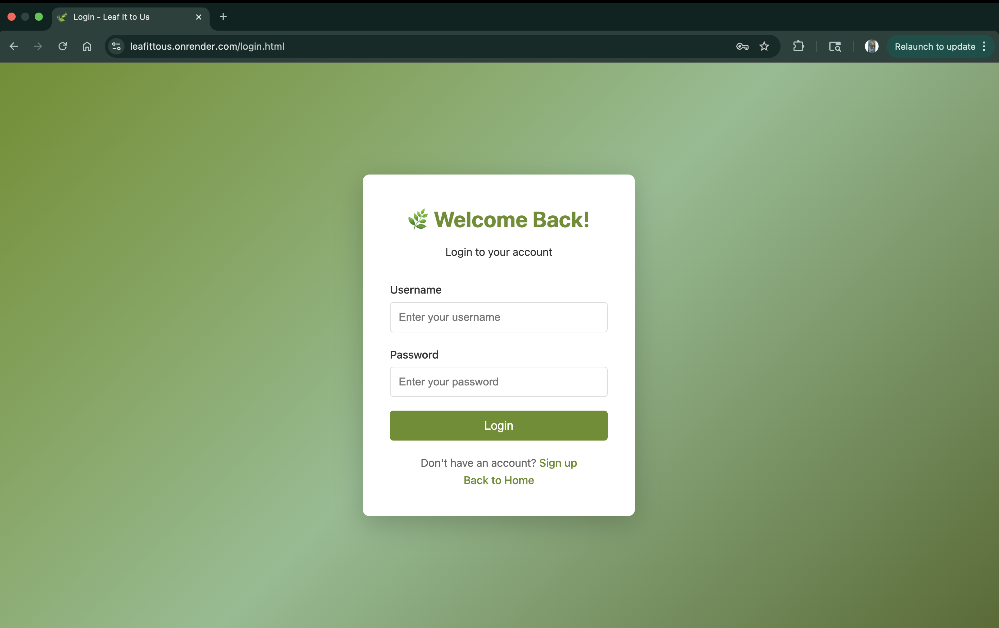
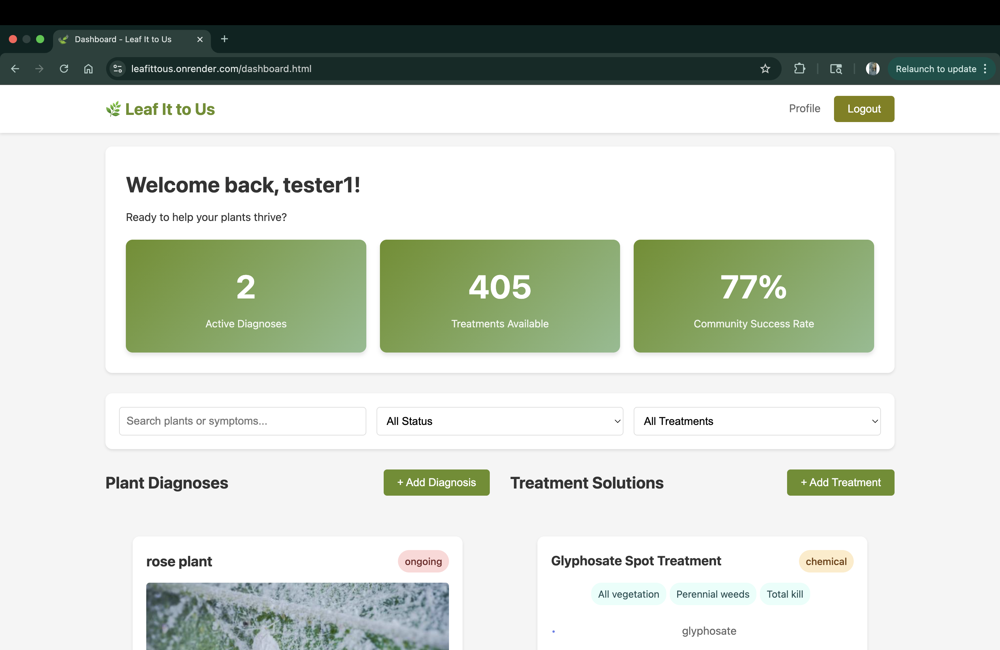
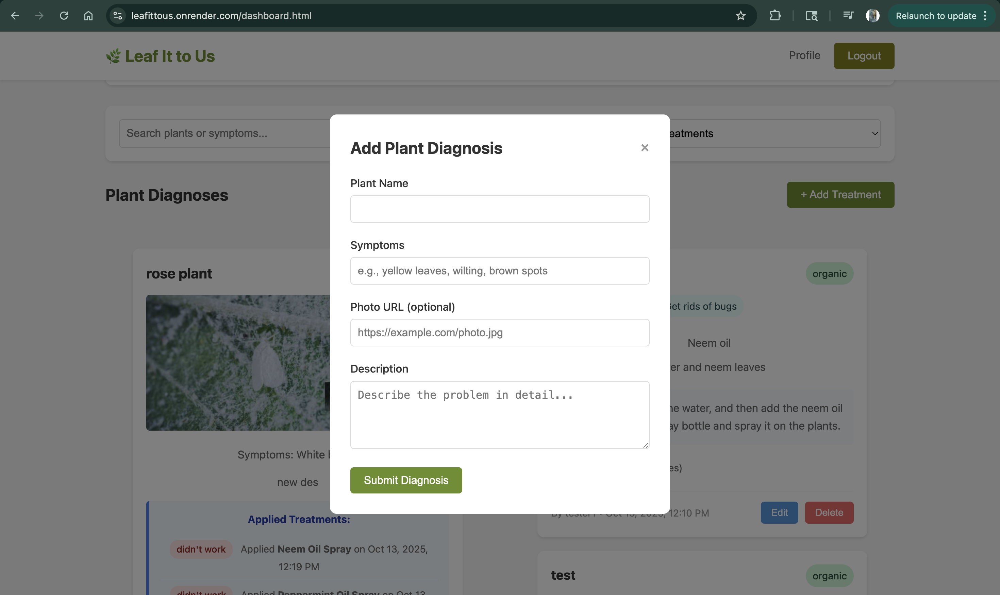
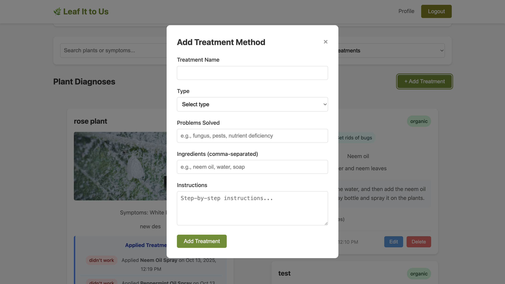
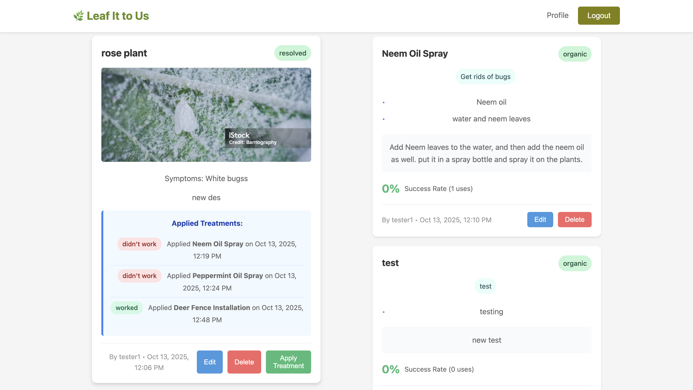
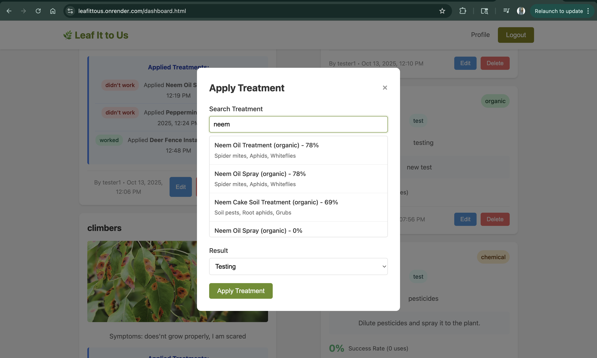
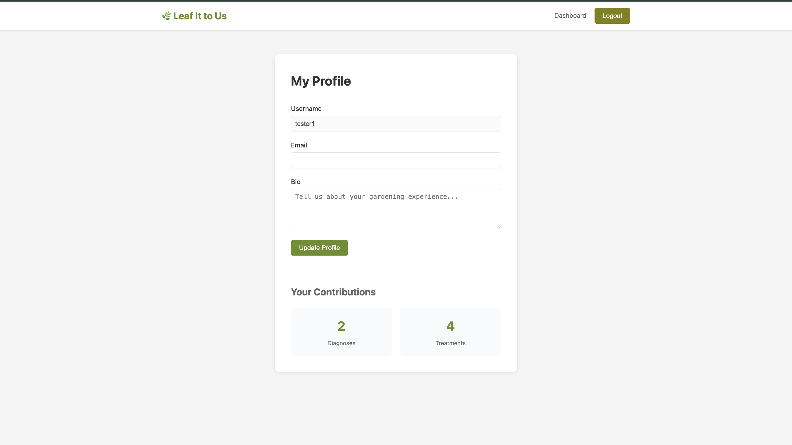

# Leaf It To Us!

## Authors
**Author 1:**
Name: Ananyaa Mylsamy  
Email: mylsamy.a@northeastern.edu  
NUID: 002022427

**Author 2:**
Name: Manasha Sekar  
Email: sekar.ma@northeastern.edu  
NUID: 002711528

## Web Development 
Course link: https://northeastern.instructure.com/courses/226004

## Objective
Build a collaborative web application where plant enthusiasts can diagnose plant health issues, share treatment solutions, and track recovery progress using Node.js, Express, MongoDB, and vanilla JavaScript.

## Features
- **User Authentication & Profiles** - Secure signup/login system to manage personal plant diagnoses, contribute treatments, and track gardening journey.
- **Disease Diagnosis Tracker** - Submit plant problems with species, symptoms, and photos; browse and search community diagnoses; update progress and status.
- **Treatment Solutions Database** - Add proven treatment methods with instructions and type (organic/chemical); browse and filter treatments by category.
- **Treatment Application System** - Apply specific treatments to diagnoses; log effectiveness results; view which treatments others used and their success rates.
- **Community Knowledge Base** - Browse similar plant problems, discover proven solutions from experienced gardeners, and build collective plant care expertise.


## Screenshots
### Landing Page


### Sign Up 


### Login


### Dashboard 


### Forms
##### Diagnosis

##### Treatment


### Entries


### Apply treatment Search bar


### Profile Page


## Live Webpage
https://leafittous.onrender.com

## Slides
https://docs.google.com/presentation/d/13cU8w33jNEzF5RX6STwZbzTthm9KhT3fNp5iPCyrMwk/edit?slide=id.g389c7506f58_0_1567#slide=id.g389c7506f58_0_1567

## Documentation
https://docs.google.com/document/d/1Ec-meutJBaaw4cw0w6GMzTTqJfABBZgBzkpjO-1rq8E/edit?tab=t.ykzohr99uo7z

## File Structure

```
 LEAFITTOUS/
├── backend/
│   ├── config/
│   │   └── database.js
│   ├── middleware/
│   │   └── auth.js
│   ├── routes/
│   │   ├── auth.js
│   │   ├── diagnoses.js
│   │   └── treatments.js
│   ├── server.js
│   └── package.json
├── frontend/
│   ├── css/
│   │   ├── base.css
│   │   ├── dashboard.css
│   │   ├── profile.css
│   │   ├── auth.css
│   │   ├── diagnoses.css
│   │   └── treatments.css
│   ├── js/
│   │   ├── modules/
│   │   │   ├── api.js
│   │   │   ├── auth.js
│   │   │   └── utils.js
│   │   ├── dashboard.js
│   │   ├── diagnoses.js
│   │   ├── applyTreatments.js
│   │   ├── login.js
│   │   ├── profile.js
│   │   └── treatments.js
│   │   
│   ├── index.html
│   ├── dashboard.html
│   ├── login.html
│   ├── profile.html
│   └── signup.html
│
└── README.md
```

## Technologies Used
- **Backend:** Node.js + Express (ES6 modules), MongoDB native driver, Express-session
- **Frontend:** HTML5 + CSS3 + Vanilla JavaScript (ES6 modules), client-side rendering
- **Tools:** ESLint, Prettier

## Instructions to Build

### Prerequisites
- Node.js (v14+)
- MongoDB Atlas account
- npm

### Setup Steps
1. Clone repository
2. Navigate to the project directory in terminal, navigate to backend directory
3. Install dependencies:
   ```bash
   npm install
   ```
4. Set up environment variables
Create a .env file in the backend directory and add your credentials:
   ```bash
    MONGODB_URI=mongodb+srv://<username>:<password>@<cluster>/leafittous
    PORT=3000
    SESSION_SECRET=<your-secret-key>
   ```

### Running the Project
1. Navigate to backend directory
2. Start the mongodb server:
   ```bash
   npm start
   ```

3. Open website at `http://localhost:3000`

## License
MIT License - Permission is hereby granted to use, copy, modify, and distribute this software.

## Contact
**Author 1:**
- Email: mylsamy.a@northeastern.edu
- LinkedIn: [linkedin.com/in/ananyaa-mylsamy/](https://www.linkedin.com/in/ananyaa-mylsamy/)
- GitHub: [github.com/Anumyl](https://github.com/Anumyl)

**Author 2:**
- Email: sekar.ma@northeastern.edu
- LinkedIn: [linkedin.com/in/manasha-sekar](https://www.linkedin.com/in/manasha-sekar-240326148)
- GitHub: [github.com/manasha](https://github.com/manasha2402)

## References
- Images - https://pixabay.com
- Sample data generated by https://www.mockaroo.com/ and Claude.

## GenAI Usage Documentation
1. **Brainstorming**
   - Prompt: "I want shades for green to put in my web project give me few gradients"
   - Used AI to explore suitable green color gradients for the webpage palette.
2. **Git Issue**              
   - Prompt: "I am facing this git merge issues, attaching screenshot"
   - Issue: Both collaborators edited the same file locally and committed separately, leading to merge conflicts.
   - Used AI to understand and resolve these merge conflicts.
3. **Mongo Atlas**
   - Prompts: "I want to export my collection from Mongo Atlas what should I do" and "How do I drop a key from all entries?"
   - Issue: Needed to drop a specific key–value pair from all records in a collection.
   - Used AI to identify the correct steps to export data and modify the collection respectively.
